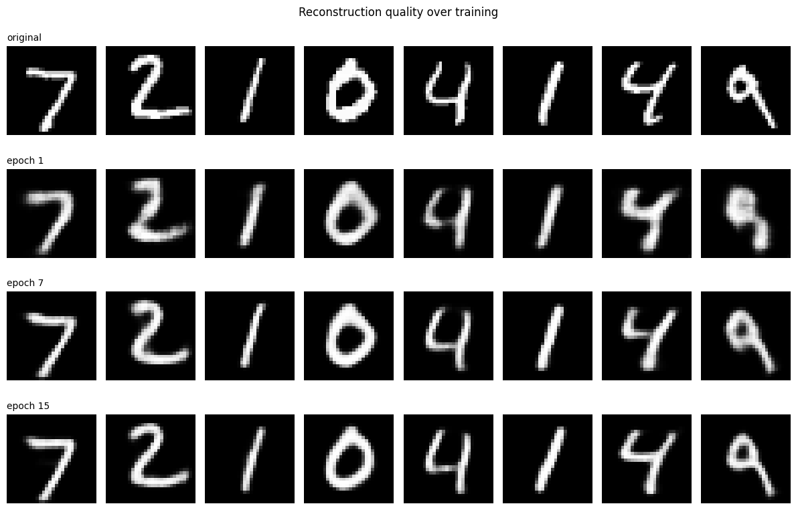
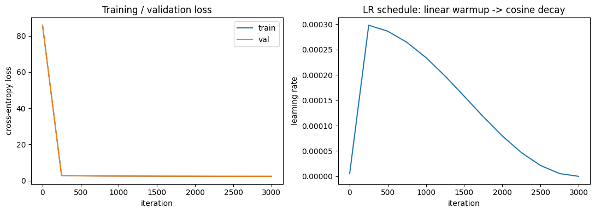

# Generative & Sequence Models from Scratch (PyTorch)

Two generative deep learning models implemented from first principles in PyTorch — a convolutional Variational Autoencoder (VAE) trained on MNIST, and a GPT-style decoder-only Transformer trained character-by-character on Shakespeare. Built for a graduate Deep Learning course, with an emphasis on implementing the core mechanics by hand rather than relying on high-level library shortcuts.

## Part 1 — Convolutional VAE (MNIST)

A VAE learns a compressed, continuous latent representation of the data by training an encoder and decoder jointly against a loss that balances reconstruction accuracy with how well the latent space matches a simple prior distribution.

**Implemented from scratch:**
- Convolutional encoder outputting a mean and log-variance per latent dimension
- The reparameterization trick, so gradients can flow through the sampling step
- Convolutional decoder reconstructing images from latent codes
- The VAE loss: binary cross-entropy reconstruction term + KL-divergence regularization term

**Experiment — the effect of β:** the standard VAE loss weights the KL term by a factor β. A higher β pushes the latent space to match the prior more closely (better sampling, more regularized latent space) at the cost of blurrier reconstructions. This project trains and compares **β = 1** against **β = 4** to see that trade-off directly, then evaluates the result three ways: reconstruction quality across training, latent-space interpolation between digits, and samples drawn purely from the prior.



## Part 2 — Decoder-Only Transformer (Shakespeare, character-level)

A GPT-style language model trained to predict the next character in Shakespeare's text, built without PyTorch's built-in attention layers.

**Implemented from scratch:**
- Causal multi-head self-attention, written directly against Q/K/V projections and a triangular attention mask (no `nn.MultiheadAttention`)
- Transformer blocks with residual connections and layer normalization
- A training loop using mixed-precision training (`torch.cuda.amp`), selective weight decay (none on biases/LayerNorm parameters), and a linear-warmup-then-cosine-decay learning rate schedule
- Three sampling strategies for generation: greedy, temperature sampling, and top-k sampling

**Result:** a 0.82M-parameter model trained for 3,000 iterations, reaching a training loss of 2.324 and validation loss of 2.350 — the two track closely throughout training, indicating minimal overfitting for the model's capacity.



## Tech Stack

Python · PyTorch (`nn.Module`, custom attention/training loop, `torch.cuda.amp`) · Matplotlib

## Running This Project

```bash
pip install torch torchvision matplotlib jupyter
jupyter notebook part1_vae_mnist.ipynb           # VAE
jupyter notebook part2_transformer_shakespeare.ipynb   # Transformer
```

Both notebooks are self-contained — data loading, model definition, training loop, and evaluation are all in one file.
